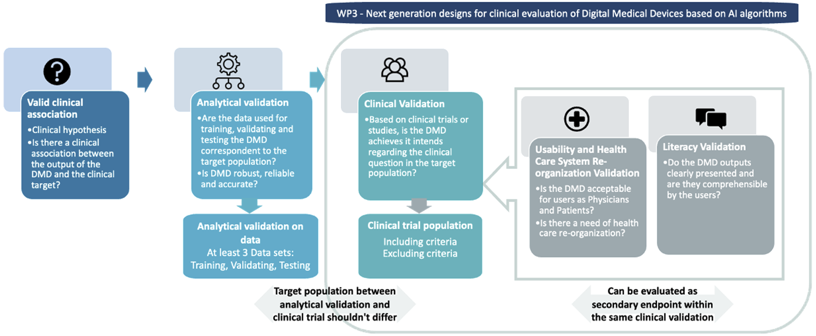

WP3 will focus on design aspects needed for the clinical validation step. Indeed, 
our aim is not to focus on the analytical validation — for which specific methods 
will be proposed in the AI PEPR regarding robustness and accuracy of AI based 
algorithms — but rather on proposing clinical trial or RWD (real world data) 
study designs, in which the patient’s outcomes are always primary that could be 
associated with secondary endpoints related to acceptability, literacy and Care 
System Management re-organization. We will also, work on post-CE marking as it 
requires specific considerations regarding the physical (if the DMD is associated 
with a hardware), an analytical validation as well as benefit-risk evaluation.

 1. Propose novel endpoints associated with health care reorganization and digital 
 biomarkers (i.e., quantifiable physiological and behavioural data that are 
 collected and measured by means of digital devices) for the evaluation of disease DMDs
 2. Develop and propose randomized adaptive clinical study designs for DMDs allowing 
 maximizing response and minimizing risks for software or software associated with 
 hardware used by patients.
 3. Develop approaches to evaluate the effectiveness of DMDs for prevention and 
 disease monitoring using real world data
 4. Propose new methodology for assessing modifications or corrections of 
 devices (algorithms, software...) that lowers the costs of evaluation while 
 maintaining validity and control for small modification.
 5. Assess and provide methods for regulatory needs in terms of evaluation of DMDs
